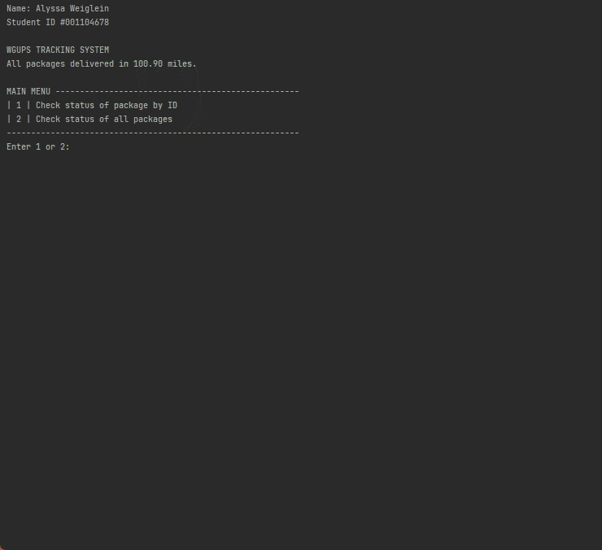

# SpeedRouter
###### A CLI application that uses algorithms to map the quickest route for package delivery. 

  <kbd>
</img>
  </kbd>

 

[How to Run](https://github.com/aweiglein/RoutingSystem#how-to-run)  
[Program Navigation](https://github.com/aweiglein/RoutingSystem#program-navigation)  
[Assignment Scenario](https://github.com/aweiglein/RoutingSystem#assignment-scenario)  
[Competencies](https://github.com/aweiglein/RoutingSystem#competencies)  

### How to Run
Run main.py

### Program Navigation
Follow the instructions in the command line interface to look up information about the packages routes and timeframes.

### Assignment Scenario
> The Western Governors University Parcel Service (WGUPS) needs to determine the best route and delivery distribution for their Daily Local Deliveries (DLD) because packages are not currently being consistently delivered by their promised deadline. The Salt Lake City DLD route has three trucks, two drivers, and an average of 40 packages to deliver each day; each package has specific criteria and delivery requirements.  
> 
> Your task is to determine the best algorithm, write code, and present a solution where all 40 packages, listed in the attached “WGUPS Package File,” will be delivered on time with the least number of miles added to the combined mileage total of all trucks. The specific delivery locations are shown on the attached “Salt Lake City Downtown Map” and distances to each location are given in the attached “WGUPS Distance Table.”  
> 
> While you work on this assessment, take into consideration the specific delivery time expected for each package and the possibility that the delivery requirements—including the expected delivery time—can be changed by management at any time and at any point along the chosen route. In addition, you should keep in mind that the supervisor should be able to see, at assigned points, the progress of each truck and its packages by any of the variables listed in the “WGUPS Package File,” including what has been delivered and what time the delivery occurred.  
> 
> The intent is to use this solution (program) for this specific location and to use the same program in many cities in each state where WGU has a presence. As such, you will need to include detailed comments, following the industry-standard Python style guide, to make your code easy to read and to justify the decisions you made while writing your program.
> 
> #### Assumptions:
> <li>Each truck can carry a maximum of 16 packages.</li>
> <li>Trucks travel at an average speed of 18 miles per hour.</li>
> <li>Trucks have a “infinite amount of gas” with no need to stop.</li>
> <li>Each driver stays with the same truck as long as that truck is in service.</li>
> <li>Drivers leave the hub at 8:00 a.m., with the truck loaded, and can return to the hub for packages if needed. The day ends when all 40 packages have been delivered.</li>
> <li>Delivery time is instantaneous, i.e., no time passes while at a delivery (that time is factored into the average speed of the trucks).</li>
> <li>There is up to one special note for each package.</li>
> <li>The wrong delivery address for package #9, Third District Juvenile Court, will be corrected at 10:20 a.m. The correct address is 410 S State St., Salt Lake City, UT 84111.</li>
> <li>The package ID is unique; there are no collisions.</li>
> <li>No further assumptions exist or are allowed.</li>

### Competencies
**Non-Linear Data**  
The graduate creates software applications that incorporate non-linear data structures for efficient and maintainable software.

**Hashing Algorithms and Structures**  
The graduate writes code using hashing techniques within an application to perform searching operations.

**Dictionaries and Sets**  
The graduate incorporates dictionaries and sets in order to organize data into key-value pairs.

**Self-Adjusting Data Structures**  
The graduate evaluates the space and time complexity of self-adjusting data structures using big-O notation to improve the performance of applications.

**Self-Adjusting Heuristics**  
The graduate writes code using self-adjusting heuristics to improve the performance of applications.

**NP-Completeness and Turing Machines**  
The graduate evaluates computational complexity theories in order to apply models to specific scenarios.
